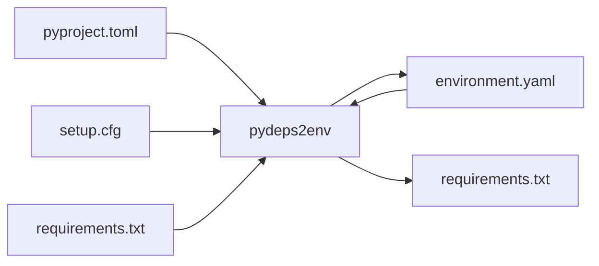

# pydeps2env

An easy way to create conda environment files from you python project dependencies.  
Creates a conda `environment.yml` file from python package dependencies listed in a `pyproject.toml` or `setup.cfg` file.

The project contains
- GitHub action
- python package
- command line script



## basic usage (GitHub action)

By default, the action will parse a `pyproject.toml` file in your root directory into `environment.yml`. Here is an example
of a simple setup:

```yaml
steps:
  - uses: CagtayFabry/pydeps2env@v1.0.0
```

```toml
[project]
requires-python = ">=3.8,<3.10"
dependencies = [
    "numpy >=1.20",
    "pandas >=1.0",
    "IPython",
    "boltons",
]
[project.optional-dependencies]
test = ["pytest"]
pip_only = ["bidict"]
```

The default parameters will output this sorted `environment.yml` (note that the `python` dependency will always be the first item on the list):

```yaml
channels:
  - defaults
dependencies:
  - python>=3.8,<3.10
  - boltons
  - IPython
  - numpy>=1.20
  - pandas>=1.0
```

A full output with options `--build_system include --extras test pip_only --pip bidict`

```yaml
channels:
  - defaults
dependencies:
  - python>=3.8,<3.10
  - boltons
  - IPython
  - numpy>=1.20
  - pandas>=1.0
  - pytest
  - setuptools>=40.9.0
  - setuptools_scm
  - wheel
  - pip:
    - bidict
```

## configuration options

To customize the output the input options are available to the action:

### files

Specify the location of the `'setup.cfg'` or `'pyproject.toml'` files to parse. (defaults to `'pyproject.toml'`)
Multiple files can be listed. This will result in a combined environment file.

### output:

Specify the location and name of the conda environment file to generate. (defaults to `'environment.yml'`)

### channels:

List the conda channels to include in the environment file. (defaults to `'conda-forge'`)
Separate a list of multiple channels by spaces (e.g. `'conda-forge defaults'`).

### extras:

Specify one or more optional `[extras_require]` sections to add to all the environments (e.g. `'test'` to include package that
you would normally install with `pip install pkg[test]`).
Note that for individual packages, the [extra]` syntax is also possible.

### setup_requires:

If set to `'include'` the dependencies listed under `[options:setup_requires]` will be added to the environment (default
is `'omit'` so no setup dependencies will be installed).

### pip
List of packages to install via `pip` instead of `conda`.
The dependencies will be listet under the `pip:` section in the environment file.

## example

```yaml
steps:
  - uses: CagtayFabry/pydeps2env@v1.0.0
    with:
      files: ./test/pyproject.toml[doc] ./test/setup.cfg # comine both files, add [doc] only for pyproject.toml
      output: 'environment_test.yml'
      channels: 'conda-forge defaults'
      extras: 'test'
      setup_requires: 'include'
      pip: 'bidict'
```

```toml
[project]
requires-python = ">=3.8,<3.10"
dependencies = [
    "numpy >=1.20",
    "pandas >=1.0",
    "IPython",
    "boltons",
]
[project.optional-dependencies]
test = ["pytest"]
pip_only = ["bidict"]
```

```yaml
channels:
  - conda-forge
  - defaults
dependencies:
  - python>=3.8,<3.10
  - boltons
  - IPython
  - numpy>=1.20
  - pandas>=1.0
  - pytest
  - setuptools>=40.9.0
  - setuptools_scm
  - sphinx
  - wheel
  - pip:
    - bidict
```
